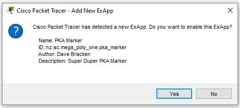
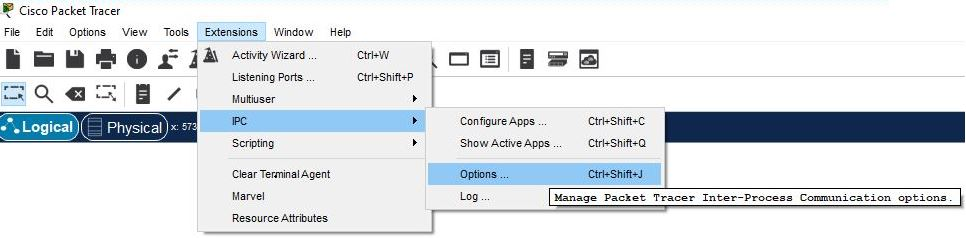
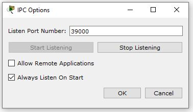
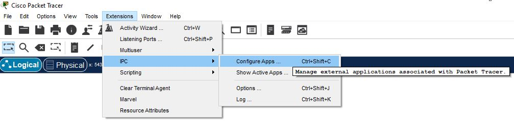
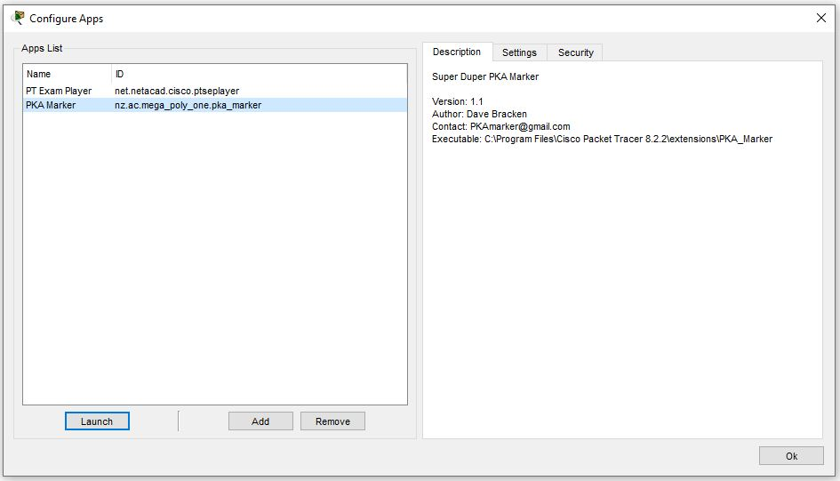
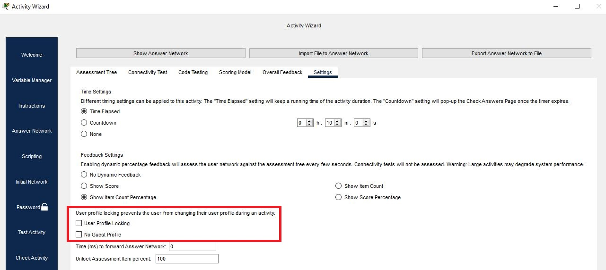
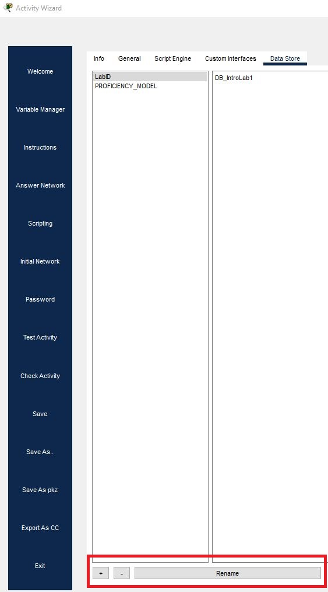
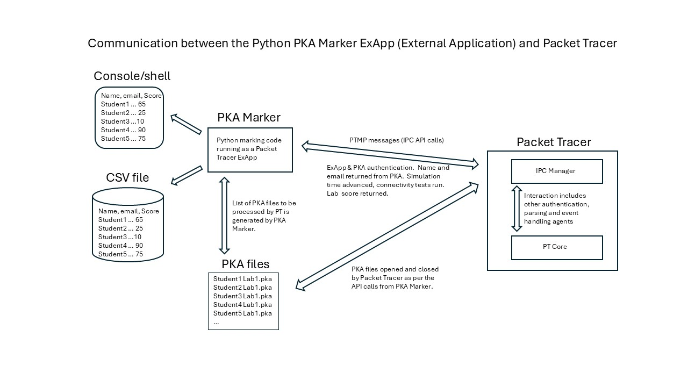

# Overview.
PKA Marker is a Cisco PKA (Packet Tracer Activity) file marker appliction implemented in Python.  PKA Marker uses an independently written Python version of Cisco's PTMP (Packet Tracer Messaging Protocol) to communicate with Packet Tracer's Inter Process Communication (IPC).  

The PKA Marker positions academic or technical training staff who are either not using Cisco's marking process or who are considering alternatives to automate the marking of PKA files.  It provides functionaility not provided by Cisco's current marking solution.

The PKA Marker can display the results in the console (shell) as well as outputting the results to a CSV file.  The CSV can be uploded to a VLE.

In addition to Cisco's marking process, the PKA Marker addreses maintaining academic integrity in the marking of PKA files.

The PKA Marker offers an alternative for marking Cisco NetAcad PKA files as well as custom created PKA files. 

  

The PKA Marker is a command line application which obtains the student information and marks using an instance of Packet Tracer.  PKA Marker is configured via configuration files and supports command line options.  Running PKA Marker without any command line options generates the results seen below where the configuration file refers to the directory that the example PKA files are stored in.

The underscores in the email addresses above are present to emphasise that this is a fictitious domain.  

# Installation and use.

The examples show PKA Marker being run on Windows 10.

## Running the PKA marker.
In the example below, PKA Marker obtains the scores for the PKA files in the *sample_pka_files* directory (which is specified in the *.env.shared* configuration file). 
<pre>
PS C:\Users\Dave\downloads\pka_marker> ./pka_marker.py  
student_full_name,student_email_addr,lab_score,rounded_lab_score
First1 Last1,,0.0,0.0
First2 Last2,First2.Last2@students.mega_poly_one.ac.nz,0.0,0.0
First3 Last3,First3.Last3@students.mega_poly_one.ac.nz,16.6667,16.7
First4 Last4,First4.Last4@students.mega_poly_one.ac.nz,33.3333,33.3
First5 Last5,First5.Last5@students.mega_poly_one.ac.nz,66.6667,66.7
First6 Last6,First6.Last6@students.mega_poly_one.ac.nz,83.3333,83.3
First7 Last7,First7.Last7@students.mega_poly_one.ac.nz,100.0,100.0
</pre>

The above output shows the full name (Firstx Lastx) of each student, their email address (if entered in the profile), raw score and the score rounded to 1 D.P (specified in a configuration file).  The Lab ID option is not displayed above as it was disabled in the *.env.shared* configuration file at the time.  See [Lab-ID feature](#lab_id-feature) for details.


##  Installation.
Quick setup.

This assumes all the files from GitHub have been downloaded.

1. Install the required python-dotenv module.  
   <pre>pip install -r requirements.txt  </pre>
   or  
   <pre>pip install python-dotenv  </pre>
  
2. Register the ExApp (Cisco External Application) with Packet Tracer.  The ExApp (PKA Marker in this case) needs to initially authenticate with Packet Tracer.  
   An encrypted XML file has been provided as an example.  
   Create a *PKA_Marker* subdirectory in the *extensions* Packet Tracer directory e.g. if you are using the current (mid 2025) 8.2.2 released version then in
   <pre>
   C:\Program Files\Cisco Packet Tracer 8.2.2\extensions
   </pre>
   
   Copy *pka_marker.pta* from the *ExApp XML configuration* subdirectory to the *PKA_Marker* subdirectory you just created.  *pka_marker.pta* is an encrypted version of *pka_marker.xml* that is in the *ExApp XML configuration* subdirectory.  For the quick setup, use the *pka_marker.pta* that is provided. Modifying *pka_marker.xml* is covered in the [Modifying ExApp XML](#modifying-the-exapp-xml-meta-file) section.

3. Start Packet Tracer.  
   Click Yes in the Add New ExApp GUI to register the ExApp.  
  

   There is nothing else to configure at this stage.

   For info.  The *.env.shared* file refers to the example PKA files in the *Sample PKA files* subdirectory and the ExApp credentials in *.env.secret* will authenticate to Packet Tracer using the settings in *pka_marker.pta*
   which were derived from *pka_marker.xml*. 

5. Run *./pka_marker.py*  
   The following should be displayed on the console:
   <pre>
   student_full_name,student_email_addr,lab_score,rounded_lab_score,lab_id
   First1 Last1,,0.0,0.0,DB_IntroLab1
   First2 Last2,First2.Last2@students.mega_poly_one.ac.nz,0.0,0.0,DB_IntroLab1
   First3 Last3,First3.Last3@students.mega_poly_one.ac.nz,16.6667,16.7,DB_IntroLab1
   First4 Last4,First4.Last4@students.mega_poly_one.ac.nz,33.3333,33.3,DB_IntroLab1
   First5 Last5,First5.Last5@students.mega_poly_one.ac.nz,66.6667,66.7,DB_IntroLab1
   First6 Last6,First6.Last6@students.mega_poly_one.ac.nz,83.3333,83.3,DB_IntroLab1
   First7 Last7,First7.Last7@students.mega_poly_one.ac.nz,100.0,100.0,DB_IntroLab1
   First8 Last8,First8.Last8@students.mega_poly_one.ac.nz,100.0,100.0,DB_IntroLab1-2024
   Guest,,0.0,0.0,DB_IntroLab1
   </pre>

   As long as you see the above, well done, you have marked a batch of PKA's!

   If marking your own PKA's is the next step for you, then you will need to change the PKA password (PKA_LAB_PASSWORD) in *.env.secrets* and the PKA directory (PKA_BASE_DIR) in *.env.shared* or specify the directory via the command line.

   While marking, the author typically runs Packet Tracer with the --no-gui option.
   <pre>PS C:\Program Files\Cisco Packet Tracer 8.2.2\bin> .\PacketTracer.exe --no-gui</pre>


## Command line options.
The command line options allow some of the settings stored in configuration files to be overriden.  See [Configuration file options](#configuration-file-options) for details.
The command line options can be seen by running *pka_marker* with `--help` or `-h`
<pre>
options:
  -h, --help                             show this help message and exit
  --data-store-id DATA_STORE_ID          Data store ID to use for lab ID. (default: None)
  --log-file LOG_FILE                    Path to log file. This enables the verbose option. (default: None)
  --no-console                           Disable console output. (default: False)
  --no-csv                               Send results to the console, not CSV. (default: False)
  --no-lab-id                            Do not include the Lab ID. (default: False)
  --output-file OUTPUT_FILE              Path to output CSV file. (default: None)
  --pka-dir PKA_DIR                      Path to directory containing PKA files to process. (default: None)
  --pka-file PKA_FILE                    Path to a single PKA file to process. (default: None)
  --score-rounding-dp SCORE_ROUNDING_DP  Number of decimal places to round the lab score. (default: 1)
  --test-connection                      Test connection to Packet Tracer without marking PKAs. (default: False)
  --verbose, -v                          Enable verbose logging. (default: False)
  --version, -V                          Show program version.
</pre>

- `--data-store-id` overrides `DATA_STORE_OBJECT_LAB_ID` in `.env.shared`. Retrieving the Lab ID can be disabled completely by using `DATA_STORE_OBJECT_LAB_ID = ''` in *.env.shared*  
    In the output above, `DATA_STORE_OBJECT_LAB_ID` was set to an empty string to simplify the output. In later examples it is set to the ID used in the example PKA files which is *LabID*.
    See [data store ID](#the-data-store-id) section for details on how to modify or create data store ID's.

- `--log-file` allows `LOG_FILE` specified in *.env.shared* to be overridden. Using `--log-file` enables verbose logging without requiring `--verbose` to be used.

- `--no-console` disables console output. Output will still be sent to the CSV results file `RESULTS_CSV_FILE` specified in `.env.shared` or to the file specified in `--output-file`. `--no-console` cannot be used with `--no-csv` as this would disable all output.

- `--no-csv` overrides the default value of saving the results to a CSV file, which by default is `RESULTS_CSV_FILE` in *.env.shared*

- `--no-lab-id` disables retrieving a value from the object store in the PKA if `DATA_STORE_OBJECT_LAB_ID` is set in *.env.shared*   
See the section below which covers the use of a Lab ID.

- `--output-file` allows `RESULTS_CSV_FILE` specified in `.env.shared` to be overridden.

- `--pka-dir` allows `PKA_BASE_DIR` specified in `.env.shared` to be overridden.

- `--pka-file` allows PKA Marker to mark a single PKA file rather than a directory containing multiple PKAs.

- `--score-rounding-dp` allows `SCORE_ROUNDING_DP` in *.env.shared* to be overridden. In the PT Activity window in Packet Tracer, the lab score is displayed as an integer percentage (where Show Score Pecentage is selected in Activity Wizard/Answer Network Setting section).

- `--test-connection` tests the connection to the port that Packet Tracer is expected to be listening on.  No PKA's are marked.

- `--verbose`, `-v` enables debug logging both to the console and `LOG_FILE` specified in `.env.shared` or to `--log-file` if specified.  
Debug logging shows the API level interaction between PKA Marker and Packet Tracer.

- `--version` shows the current version of PKA Marker.  

## Configuration file options.
The *.env.shared* configuration file allow for longer term options to be set but most of these can be overriden using the command line.

*.env.shared*
<pre>
RESULTS_CSV_FILE = 'IntroLab1.csv'
LOG_FILE = './pka_marker.log'
/# PKA_BASE_DIR can be an absolute or relative path
/# PKA_BASE_DIR = 'C:\Users\Dave\Downloads\pka_marker\Sample PKA files'
PKA_BASE_DIR = './Sample PKA files'
/# Set the data store object name to the ID you have used in the PKA.
DATA_STORE_OBJECT_LAB_ID = 'LabID'
/# Set the data store object name to an empty string to disable its use.
/# DATA_STORE_OBJECT_LAB_ID = ''
PT_HOST = 'localhost'
PT_PORT = 39000
SIM_TIME_ADVANCEMENT = 6
SCORE_DP = 1
</pre>

The ExApp and PKA passwords are stored in *.env.secret*.  For security reasons, credentials cannot be entered via the command line hence them not being available as command line options.  

*.env.secret*
<pre>
/# Packet Tracer External application (EXAPP) credentials
EXAPP_PASSWORD = 'ExApp_53cr3t'   
AUTHENTICATION_REQUEST_ID = 'nz.ac.mega_poly_one.pka_marker'

/# Packet Tracer PKA credentials
/# Sample lab password
PKA_LAB_PASSWORD = 'cisco_activity'  
</pre>


## Modifying the ExApp XML meta file
The ExApp settings are in './ExApp XML configuration/pka_marker.xml'.  Changing the initial key (ExApp_53cr3t) is suggested.

``` xml
<?xml version="1.0" encoding = "iso-8859-1"?>
<!DOCTYPE PT_APP_META>
<PT_APP_META>
 	<PT_VERSION>8.2.2</PT_VERSION>
 	<IPC_VERSION>1.2</IPC_VERSION>
 	<NAME>PKA Marker</NAME>
 	<VERSION>1.1</VERSION>
 	<ID>nz.ac.mega_poly_one.pka_marker</ID>
 	<DESCRIPTION>Super Duper PKA Marker</DESCRIPTION>
 	<AUTHOR>Dave Bracken</AUTHOR>
 	<CONTACT>PKAmarker@gmail.com</CONTACT>
 	<EXECUTABLE_PATH>C:\Program Files\Cisco Packet Tracer 8.2.2\extensions\PKA_Marker</EXECUTABLE_PATH>
 	<KEY>ExApp_53cr3t</KEY>
 	<SECURITY_SETTINGS>
 		<PRIVILEGE>GET_NETWORK_INFO</PRIVILEGE>
 		<PRIVILEGE>CHANGE_NETWORK_INFO</PRIVILEGE>
 		<PRIVILEGE>SIMULATION_MODE</PRIVILEGE>
 		<PRIVILEGE>MISC_GUI</PRIVILEGE>
 		<PRIVILEGE>FILE</PRIVILEGE>
 		<PRIVILEGE>CHANGE_PREFERENCES</PRIVILEGE>
 		<PRIVILEGE>CHANGE_GUI</PRIVILEGE>
 		<PRIVILEGE>ACTIVITY_WIZARD</PRIVILEGE>
 		<PRIVILEGE>MULTIUSER</PRIVILEGE>
 		<PRIVILEGE>IPC</PRIVILEGE>
 		<PRIVILEGE>APPLICATION</PRIVILEGE>
 	</SECURITY_SETTINGS>
 	<LOADING>ON_DEMAND</LOADING>
 	<SAVING>NEVER</SAVING>
 	<INSTANCES>1</INSTANCES>
</PT_APP_META>
```

Save the change to the XML file.  
Delete 'C:\Program Files\Cisco Packet Tracer 8.2.2\extensions\PKA_Marker\pka_marker.pta'.  
With '.\ExApp XML configuration\ as your current working direct, create a new PTA file by running the following in the shell:  
<pre>& 'C:\Program Files\Cisco Packet Tracer 8.2.2\bin\meta.exe' .\pka_marker.pta .\pka_marker.xml</pre>

Copy *.\ExApp XML configuration\pka_marker\pka_marker.pta* to *C:\Program Files\Cisco Packet Tracer 8.2.2\extensions\pka_marker*

Restart Packet Tracer.  

Click Yes in the Add New ExApp window as earlier.  

Update EXAPP_PASSWORD in *.env.secret* with the new key.  

Run `.\pka_marker.py` and ensure it authenticates using the updated key.  You should see the marking output shown earlier.  


# Checking Packet Tracer settings.

## Checking the port that Packet Tracer is listening on.
In Packet Tracer, from the Extensions menu, click IPC then Options.  The shortcut is Ctrl Shift J.  

The default port 39000 is reported below.  



A connectivity check can be run from PKA Marker.
<pre>.\pka_marker.py --test-connection
Packet Tracer is available on localhost:39000.
</pre>


## Checking the ExApp is registered.
From the Extensions menu click IPC then Configured Apps.  The shortcut is Ctrl Shift C.

Click PKA Marker  



# Modifying PKA's

## Background.

At an academic institution in Christchurch in New Zealand, the first year networking course is CCNA1.  In 2023, after raising concern that the answers to the Cisco NetAcad PKA labs are widely available, the author created new PKA labs for the course as well as interactive Moodle labs that tested both practical skills (using both Packet Tracer and the extensive rack mounted Cisco equipment in the room adjacent to the labs) as well as subject theory. Prior to this, students were expected to record their lab findings in the lab book which was manually marked at the end of the semester.  

The immediate benefits of the change were that the students could see their lab score in the PKA and in Moodle (VLE) when they submitted their answers for the interactive online labs.  Students responded well to the move and the staff noted a positive change in engagement.  This did however mean that the marks from the new PKA labs had to be recorded and while staff within the team were happy on a class by class basis to manually enter them, the author had already started the automated PKA marking process initially using Java.  Eventually the solution was rewritten in Python.  

From the outset, addressing academic integrity aspects was paramount.  In the Packet Tracer's Activity Wizard, the combination of using the 'User Profile Locking' and 'No Guest Profile' settings ensures a student can't give a completed lab to another student who can then claim it as their work.  If the second student tries to change the name in the profile, the lab resets back to the start.  'No Guest Profile' ensures that a name must be entered.  The students were instructed to enter their email addresses as well as ths field was used to identify them in the VLE so their score can be assigned to them when the CSV file for the lab was uploaded.  

Typically the labs were due midnight Sunday and all the marks from the submitted PKA's were uploaded to the VLE by 10:00 on Monday or earlier.  With course sizes between 80 and 120, the manual effort here would have been significant without a degree of automation. This meant that the students knew exacly where they stood course mark wise week by week which they appreciated.

To see this, select Activity Wizard from the Extensions menu in Packet Tracer. Click Answer Network on the left, then Settings on the right.

Click both and Save your PKA.  In the sample PKA's, both options are selected.

## Lab_ID feature
The Lab_ID feature is optional but strongly advised if you are creating your own PKA's.  It only takes a few seconds to add the ID and set the value in the PKA.
Setting an ID on each PKA lab (unique to the lab, not individual instance of a student  file) ensures that students can't reuse an older PKA because the value of the ID will be different for each lab.

In a semi automated marking process, it might be possible for a student to submit one of their PKA files that they scored 100% in for another lab.  Adding a lab identifier to the data store in the PKA addresses this.  In the example PKA files, this is implemented as using LabID.  As the PKA is protected by the PKA password which is not known to the students, the student can't change the lab identifier. If you implement this, feel free to name the object as you choose.

Example.  
Student First1 Last1 submits *Lab 1-1 First1 Last1.pka* and scores 100%.  A few weeks later they decide not to do *Lab 4-1.pka* and copy their *Lab 1-1 First1 Last1.pka* to *Lab 4-1 First1 Last1.pka* and submit it.
As *Lab 1-1.pka* will have a LabID of *Networking101_lab1-1* and *Lab 4-1.pka* will have a LabID of *Networking101_lab4-1*, when the results are obtained, it will be obvious that they have haven't submitted the correct PKA lab file for Lab 4-1.

Without a LabID, the person marking the PKA's needs to inspect each PKA to ensure that a student cannot merely rename a previous lab which negates the entire purpose of using an automated marking process.

It was also noted that where more than one lab was due each week which for most of the course was the case, there were occasions where a student mixed the labs up and submitted the wrong PKA's to the wrong lab in the VLE.  Having the LabID shown in the CSV highlighted this and allowed it to be manually changed (after a quick check) before all the CSV's for the previous week were uploaded to the VLE.  Alternatively the student could be given another chance at uploading the PKA and after running a file comparison utility to ensure no subsequent changes had been made, mark the lab again.

By adding a simple LabID to each lab PKA, aspects such as this can be identified.


### The Data Store ID.  
From the Activity Wizard, click Scripting on the left, then Data Store at the top on the right.
  
The ID from a the sample PKA is shown below.  
  
The name of the ID is *LabID* and its value is *DB_IntroLab1*.  This is the same for all the sample PKA's provided.
You can add, remove or rename and ID using the options highlighted above.  Ensure that *.env.shared* reflects the name of your ID.  You can also specify the name of the ID on the command line.


## How it works.
Cisco's IPC API, which is is written in Java is an extensive API for managing all aspects of Packet Tracer.  The PKA Marker includes a subset of this API (written in Python) which is enough to authenticate to Packet Tracer both as an external application as well as to the PKA itself.  The Python implementation provides the ability to load a PKA in Packet Tracer, get the name and email address of the student who submitted the PKA, run the connectivity tests, obtain a score and close the file.  


PKA Marker initially tests the connection to the port that Packet Tracer is configured to listen to.  As long as the test is successful, PKA Marker then negotiates (well, asks nicely) the terms to be used for further communication.  Passwords are not transferred in plain text.  PKA Marker does not send PTMP keep-alives.  Once the connection has been negotiated, the ExApp (PKA Marker) needs to authenticate to Packet Tracer.

ExApp  
The PKA Marker is known to Packet Tracer as an external application and as such, it must authenticate to Packet Tracer. This aspect is provided by *pka_marker.pta* which is the encrypted form of *pka_marker.xml*.

If the ExApp authentication process is successful, then Packet Tracer can begin processing the PKA file.

PKA Marker, now authenticated as an ExApp, asks Packet Tracer to load the PKA file to be marked by calling *appWindow.fileOpen*.  PKA Marker then authenticates to the PKA by requesting a challenge key by calling *appWindow.getActiveFile.getChallengeKeyAsBase64*.  The challenge key that is received is base 64 encoded. The PKA password is added to the challenge key and hashed using MD5 and converted to upper case and sent to Packet Tracer by calling *appWindow.getActiveFile.confirmPassword*.

If the PKA password is confirmed then PKA Marker can ask for details from the PKA file.

If the LabID is to be retrieved from the script data store (DATA_STORE_OBJECT_LAB_ID refers to a non empty string and the command line option --no-lab-id has not been used) then *appWindow.getActiveFile.getScriptDataStore* is called passing it the name of the ID which in the *.env.shared* file provided is LabID.

The lab score is obtained by calling *appWindow.getActiveFile.getPercentageCompleteScore*.

The simulation time is advanced up to 6 times by calling *appWindow.getRealtimeToolbar.fastForwardTime* unless a score of 100% is received during one of the iterations.

In more complex PKA scenarios, Packet Tracer needs time to run connectivity tests and advancing the simulation time addresses this.  This behavior that can be seen in the Packet Tracer's PT Activity window when pressing Check Results results in updating the completion score and eventually seeing the final score.

The name the student entered in their profile is obtained by calling *appWindow.getActiveFile.getUserProfile.getName* and their email by calling *appWindow.getActiveFile.getUserProfile.getEmail*.

The PKA file is closed by calling *appWindow.fileNew* with the value *false* to not ask for confirmation.

The next PKA file is then processed.


## Firewall requirements.
PTMP defaults to port 39000.  If you are using a remote instance of Packet Tracer, ensure that port 39000 using TCP is available.  
If you are running Packet Tracer locally, then in most cases port 39000 is available locally but depending on the security scenario in place, a firewall rule might be needed.


## Issues.
None known of in PKA Marker itself.  

PKA Marker has marked close to a thousand different PKA's and cycled around these umpteen times during the development process.
You might notice that one of the sample PKA files leaves the *User Profile* GUI open when it is loaded.  This is because this is a blank PKA where nobody has entered a name for a PKA where the use of a *Guest profile* is not allowed.  Displaying the *User Profile* window when Packet Tracer is running in GUI mode is perfectly understandable but questionable when it was invoked using --no-gui.  Ideally the API would return a new return code in this scenario but it doesn't.  The Packet Tracer team have been made aware of this.

If Packet Tracer is run using the --no-gui option, the GUI windows 'Please wait.  Opening file...' followed by "PT Activity" are shown. The Packet Tracer team have been made aware of this.

Very occasonally during development in the last few years, it was observed that PKA Marker could not connect to Packet Tracer on port 39000 locally.  In that intance, the GUI in Packet Tracer reported that it had incremented the currently used listening port by a few ports.  The author assumes the currently available port had been stored in one of the Packet Tracer (not PKA Marker) configuration files because after deleting those files and restarting Packet Tracer, it returned it to listening on the default port 39000.  In the last 3 years, this has only been observed twice (out of Packet Tracer being run thousands of times) and so is quite rare.

## Testing and development.
All testing and development was done using Packet Tracer 8.2.2 and 9.0.0 Open Beta (Build 680) on Windows 10 with Python 3.12 and 3.13, Wireshark, VSCode and NotePad++.  
Testing on Linux is underway.

## Future development.
Internationalisation using Python i18n is being considered.  
Work is underway to integrate PKA Marker within the VLE so the student will receive a mark for the lab within a few seconds of submitting it.

## Reporting Issues
If you encounter any errors or have suggestions, please [open an issue](https://github.com/davebracken/PKA-Marker/issues) on GitHub.  
Include as much detail as possible, such as your OS Version, Python version, Packet Tracer version, verbose logs (if available) and steps to reproduce the problem.  Be aware that the verbose log shows the hashed version of your PTA and PKA password.  If the error relates to your PKA file, then please provide the PKA file but having changed the password.

## Acknowledgments.
The author would like to thank Peter Edge and Ian Patterson who are the regional instructors for NetAcad in New Zealand.  

## Trademarks.
Cisco, Cisco Packet Tracer, Networking Academy, NetAcad, CCNA are trademarks or registered trademarks of Cisco and/or its affiliates in the United States and certain other countries.


## Disclaimer.
PKA Marker is not affiliated with, endorsed by, or sponsored by Cisco or by the Cisco Networking Academy.


## Requirements.
Python 3.6 and above.

python-dotenv See requirements.txt
